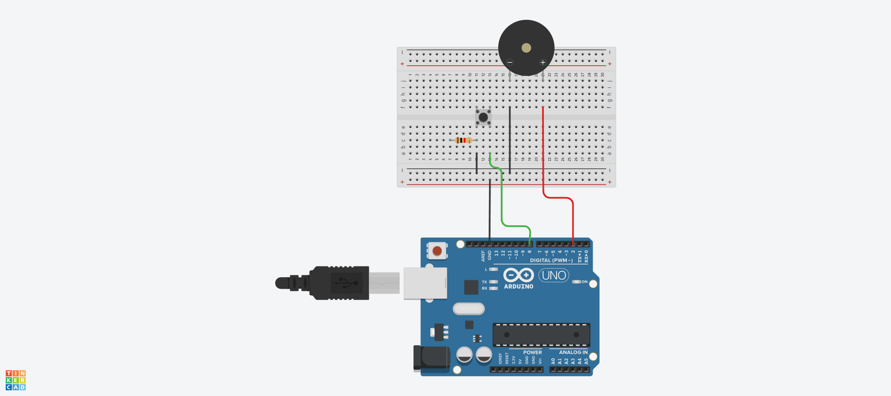

# BUZZER
## 2-1. 버튼 음으로 출력하기



## 2-2. 버튼 음으로 출력하기 Source code

```c
#define PIEZO_BUZZER 2

void setup()
{
  pinMode (8, INPUT_PULLUP);
}

void loop()
{
  if (digitalRead(8)==0) tone (PIEZO_BUZZER, 262, 1000);
  else noTone (PIEZO_BUZZER);
}
```
