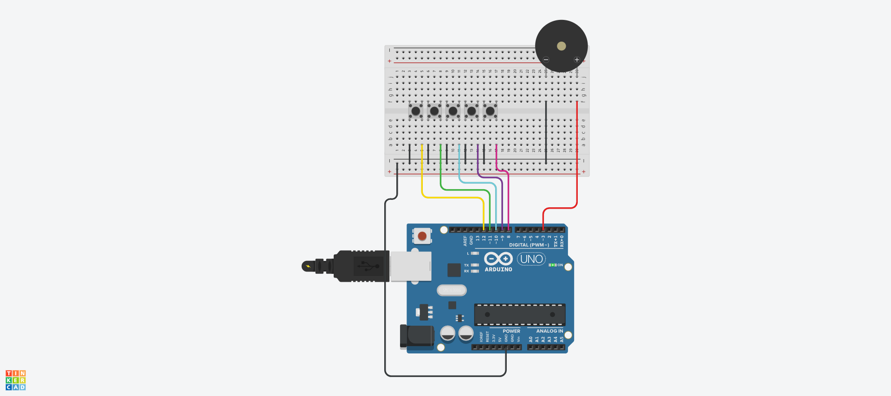

# BUZZER
## 2-1. 버튼 음으로 출력하기


## 2-2. 스위치를 음으로 출력하기 Source code

```c
#define PIEZO_BUZZER 2

void setup()
{
  pinMode (8, INPUT_PULLUP);
}

void loop()
{
  if (digitalRead(8)==0) tone (PIEZO_BUZZER, 262, 1000);
  else noTone (PIEZO_BUZZER);
}
```
## 3-1. 스위치와 부저를 이용한 전자 피아노 만들기



## 3-2. 스위치와 부저를 이용한 전자 피아노 만들기 Source code

```c
const int piezo = 7;

char code[] = {'C', 'D', 'E', 'F', 'G', 'A', 'B'};
unsigned int freq[] = {262, 294, 330, 349, 392, 440, 494};

char mData[] = "CCGGAAGpFFEEDCCpGGFFEEDpGGFFEDpCCGGAAGpFFEEDDCp";
const byte mSize = sizeof(mData) - 1;  // Exclude null terminator

void setup() {
  pinMode(piezo, OUTPUT);
}

void loop() {
  int playT = 200;  // duration in milliseconds

  for (int m = 0; m < mSize; m++) {
    char note = mData[m];

    if (note == 'p') {
      noTone(piezo);          // pause
      delay(playT);           // same duration as a note
    } else {
      for (int k = 0; k < 7; k++) {
        if (note == code[k]) {
          tone(piezo, freq[k], playT);
          delay(playT);       // wait for note to finish
          noTone(piezo);      // stop tone
          break;              // note found, break out of loop
        }
      }
    }
  }

  delay(2000);  // delay before repeating the melody
}
```
