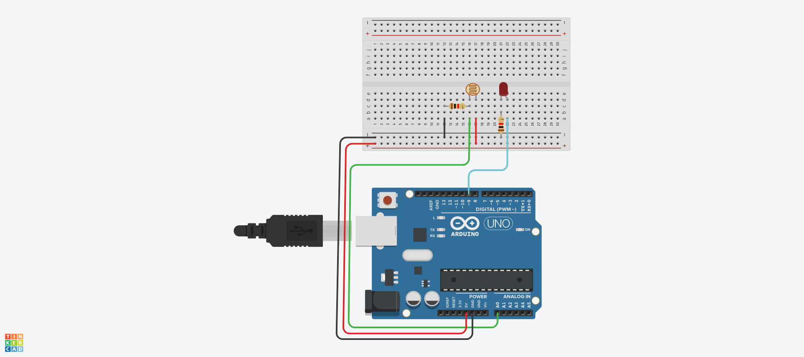

# CDS
## 1-1. 포토 레지스터 : 빛 센서



## 1-2. 포토 레지스터 : 빛 센서 Source code

```c
void setup()
{
  pinMode (9, OUTPUT);
}

void loop()
{
  int val1 = analogRead (0);
  int val2 = map (val1, 0, 1023, 0, 255);
  
  analogWrite (9, val2);
  delay (20);
}
```
