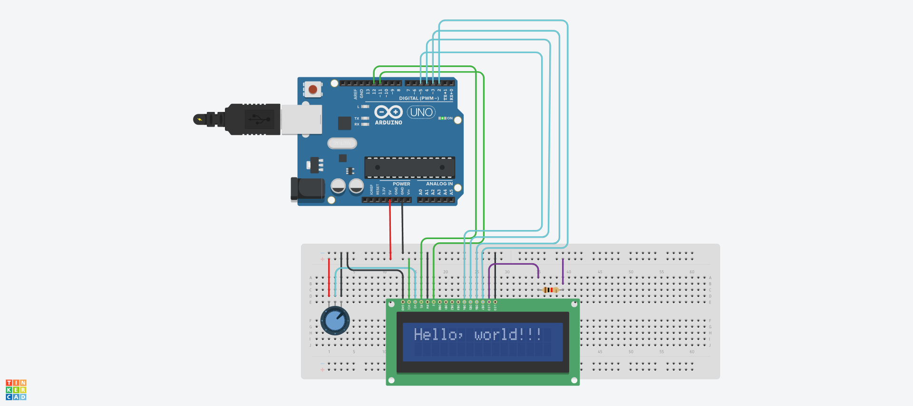
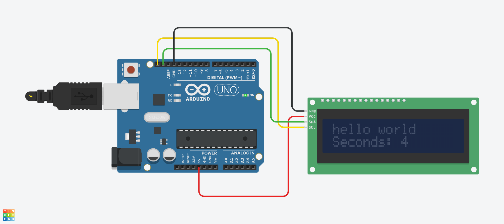

# LCD
## 1-1. LCD 16x2 "Hello, world!" 출력하기



## 1-2. LCD 16x2 "Hello, world!" 출력하기 Source code

```c
#include <LiquidCrystal.h>

LiquidCrystal lcd(12, 11, 5, 4, 3, 2);

void setup()
{
  lcd.begin (16, 2);
  lcd.print ("Hello, world!!!");
}

void loop()
{
}
```

## 2-1. I2C LCD를 이용한 문자열 출력



## 2-2. I2C LCD를 이용한 문자열 출력 Source code (Ver. Thinkercad) 

```c
#include <Adafruit_LiquidCrystal.h>

int seconds = 0;

Adafruit_LiquidCrystal lcd_1(0);

void setup() {
  lcd_1.begin(16, 2);               
  lcd_1.setBacklight(1);           
  lcd_1.print("hello world");    
}

void loop() {
  lcd_1.setCursor(0, 1);           
  lcd_1.print("Seconds: ");       
  lcd_1.print(seconds);           

  lcd_1.setBacklight(1);          
  delay(500);
  lcd_1.setBacklight(0);           
  delay(500);

  seconds += 1;                    
}

```

## 2-3. I2C LCD를 이용한 문자열 출력 Source code (Ver. Arduino IDE) 

```c
#include <LiquidCrystal_I2C.h>

int seconds = 0;

LiquidCrystal_I2C lcd (0x27, 16, 2);

void setup()
{
  lcd.init();
  lcd.backlight();
  lcd.print("Hello, world");
}

void loop()
{
  lcd.setCursor (0,1);
  lcd.print (seconds);
  lcd.setBacklight (1);
  delay (500);
  lcd.setBacklight (0);
  delay (500);
  seconds += 1;
}
```
