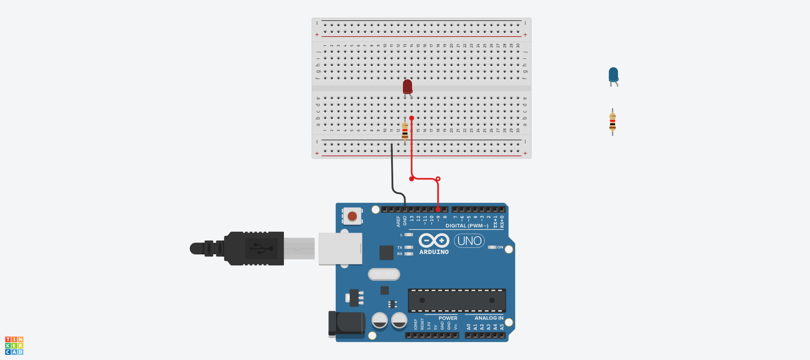
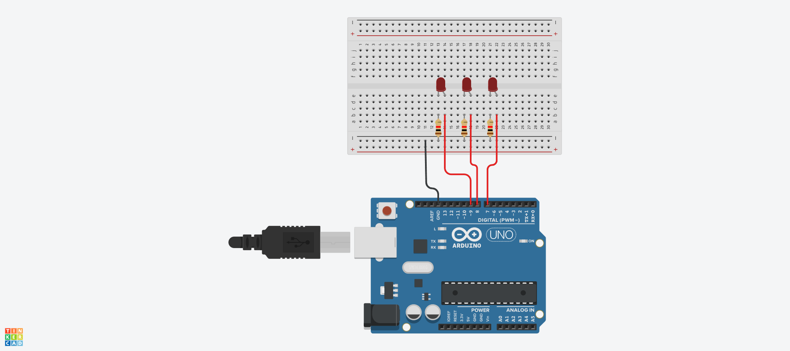

# LED

## LED 깜빡이기



## LED 깜빡이기 Source code

```c
#define LED_BUILTIN 9
void setup()
{
  pinMode(LED_BUILTIN, OUTPUT);
}

void loop()
{
  digitalWrite(LED_BUILTIN, HIGH);
  delay(1000);
  digitalWrite(LED_BUILTIN, LOW);
  delay(1000);
}
```

## a와 b로 LED 켜고 끄기 Source code
```c
void setup() {
  Serial.begin (9600);
  pinMode (9,OUTPUT);
}

void loop() {
  if(Serial.available() > 0)
{
  char sData = Serial.read();
  if (sData == 'a')
  {
    digitalWrite(9,HIGH);
  }
  else if(sData == 'b')
  {
    digitalWrite(9,LOW);
  }
}
}
```

## LED 경광등 Source code



```c
#define LED1 9
#define LED2 8 
#define LED3 7 

void setup() {
  pinMode (LED1, OUTPUT);
  pinMode (LED2, OUTPUT);
  pinMode (LED3, OUTPUT);
}

void loop() {
  digitalWrite (LED1, HIGH);
  digitalWrite (LED2, HIGH);
  digitalWrite (LED3, HIGH);
  delay (1000);
  digitalWrite (LED1, LOW);
  digitalWrite (LED2, LOW);
  digitalWrite (LED3, LOW);
  delay (1000);
}
```
