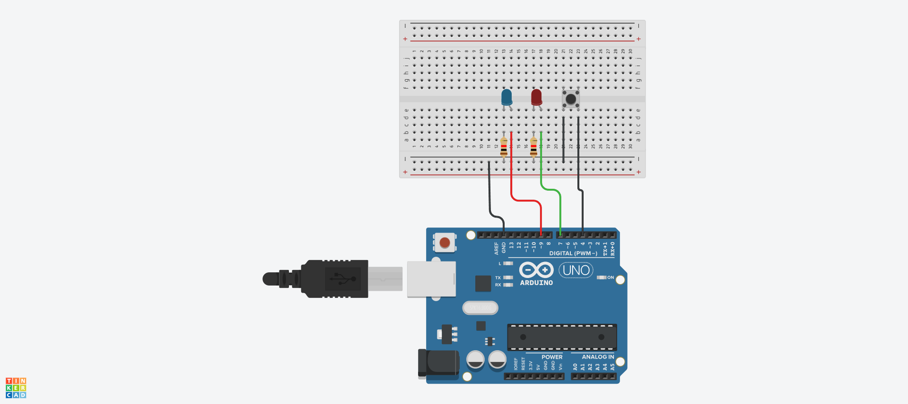
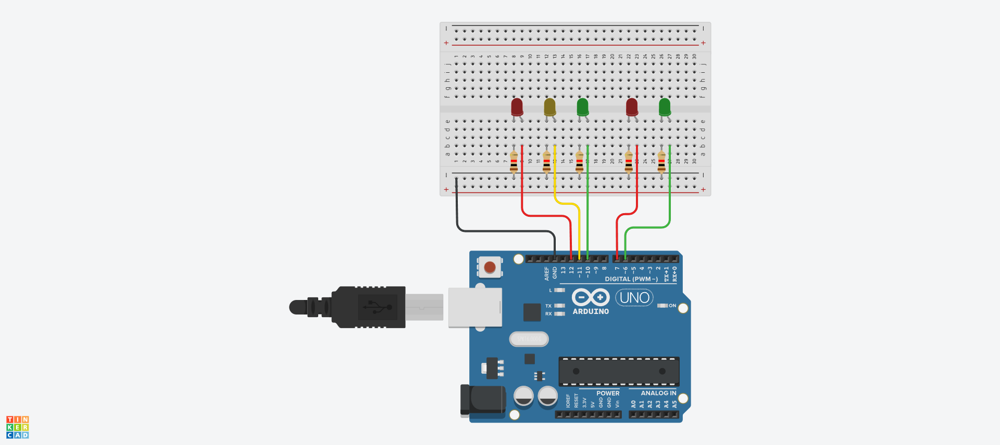
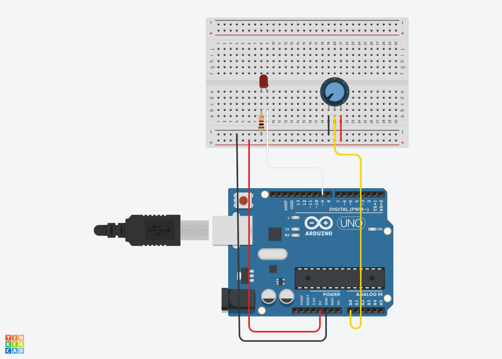

# LED

## LED 깜빡이기


## LED 깜빡이기 Source code

```c
#define LED_BUILTIN 9
void setup()
{
  pinMode(LED_BUILTIN, OUTPUT);
}

void loop()
{
  digitalWrite(LED_BUILTIN, HIGH);
  delay(1000);
  digitalWrite(LED_BUILTIN, LOW);
  delay(1000);
}
```

## a와 b로 LED 켜고 끄기 Source code
```c
void setup() {
  Serial.begin (9600);
  pinMode (9,OUTPUT);
}

void loop() {
  if(Serial.available() > 0)
{
  char sData = Serial.read();
  if (sData == 'a')
  {
    digitalWrite(9,HIGH);
  }
  else if(sData == 'b')
  {
    digitalWrite(9,LOW);
  }
}
}
```

## LED 경광등 Source code


```c
#define LED1 9
#define LED2 8 
#define LED3 7 

void setup() {
  pinMode (LED1, OUTPUT);
  pinMode (LED2, OUTPUT);
  pinMode (LED3, OUTPUT);
}

void loop() {
  digitalWrite (LED1, HIGH);
  digitalWrite (LED2, HIGH);
  digitalWrite (LED3, HIGH);
  delay (1000);
  digitalWrite (LED1, LOW);
  digitalWrite (LED2, LOW);
  digitalWrite (LED3, LOW);
  delay (1000);
}
```

## 버튼으로 LED 깜빡이기 Source code



```c
#define BUTTON 4
#define LED_BLUE 9
#define LED_RED 7
#define DELAY_TIME 80

int state = 0;

void setup()
{
  Serial.begin(9600);
  pinMode(BUTTON, INPUT_PULLUP);
  pinMode(LED_BLUE, OUTPUT);
  pinMode(LED_RED, OUTPUT);  
}

void loop()
{
  int buttonValue = !digitalRead(BUTTON);

  if (buttonValue == 1)
  {
    state = !state;
    delay(500);
  }

  if (state == 0)
  {
    digitalWrite(LED_BLUE, HIGH); 
    digitalWrite(LED_RED, LOW);  
    delay(DELAY_TIME);            
    digitalWrite(LED_RED, HIGH);  
    digitalWrite(LED_BLUE, LOW);  
    delay(DELAY_TIME);            
  }

  else if (state == 1)
  {
    digitalWrite(LED_BLUE, LOW); 
    digitalWrite(LED_RED, LOW);  
  }
}
```

## 신호등 LED Source code



```c
#define CAR_LED_RED 12
#define CAR_LED_YELLOW 11
#define CAR_LED_GREEN 10
#define HUMAN_LED_RED 7
#define HUMAN_LED_GREEN 6

void setup()
{
  pinMode(CAR_LED_RED, OUTPUT);
  pinMode(CAR_LED_YELLOW, OUTPUT);
  pinMode(CAR_LED_GREEN, OUTPUT);
  pinMode(HUMAN_LED_RED, OUTPUT);
  pinMode(HUMAN_LED_GREEN, OUTPUT);
}

void loop()
{
  digitalWrite(CAR_LED_RED, LOW);
  digitalWrite(CAR_LED_YELLOW, LOW);
  digitalWrite(CAR_LED_GREEN, HIGH);
  digitalWrite(HUMAN_LED_RED, HIGH);
  digitalWrite(HUMAN_LED_GREEN, LOW);
  delay(5000);
  digitalWrite(CAR_LED_RED, LOW);
  digitalWrite(CAR_LED_YELLOW, HIGH);
  digitalWrite(CAR_LED_GREEN, LOW);
  digitalWrite(HUMAN_LED_RED, HIGH);
  digitalWrite(HUMAN_LED_GREEN, LOW);
  delay(5000);
  
digitalWrite(CAR_LED_RED, HIGH);
  digitalWrite(CAR_LED_YELLOW, LOW);
  digitalWrite(CAR_LED_GREEN, LOW);
  digitalWrite(HUMAN_LED_RED, LOW);
  digitalWrite(HUMAN_LED_GREEN, HIGH);
  delay(2000);
  digitalWrite(HUMAN_LED_GREEN, LOW);
  delay(500);
  digitalWrite(HUMAN_LED_GREEN, HIGH);
  delay(500);
  digitalWrite(HUMAN_LED_GREEN, LOW);
  delay(500);
  digitalWrite(HUMAN_LED_GREEN, HIGH);
  delay(500);
  digitalWrite(HUMAN_LED_GREEN, LOW);
  delay(500);
  digitalWrite(HUMAN_LED_GREEN, HIGH);
  delay(500);
}
```

## 스탠드 LED (가변저항 사용) Source code



```c
#define LED 9
#define VR A0

void setup(){
  Serial.begin(9600);
}

void loop(){
  int analogValue = analogRead(VR);
  int analogMapping = map(analogValue, 0, 1023, 0, 255);
  
  analogWrite(LED, analogMapping);
}

```
