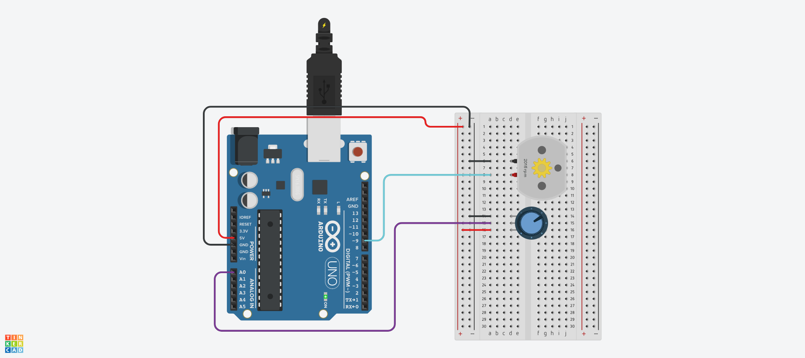

# SENSOR

## 1-1. 초음파 거리 센서 (Ver. 4Pin)


## 1-2. 초음파 거리 센서 (Ver. 4Pin) Source code

```c
int trig = 2;
int echo = 3;
int RED = 8;
int YELLOW = 9;
int GREEN = 10;

void setup ()
{
  Serial.begin (9600);
  pinMode (trig, OUTPUT);
  pinMode (echo, INPUT);
  pinMode (RED, OUTPUT);
  pinMode (YELLOW, OUTPUT);
  pinMode (GREEN, OUTPUT);
}

void loop ()
{
  digitalWrite (trig, HIGH);
  delayMicroseconds (10);
  digitalWrite (trig, LOW);
  
  unsigned long duration = pulseIn(echo, HIGH);
  float distance = ((float)(340 * duration) / 10000) / 2;
  
  Serial.print (distance);
  Serial.println ("cm");
  delay (100);
  
  if (distance > 80)
  {
    digitalWrite (GREEN, HIGH);
    digitalWrite (YELLOW, LOW);
    digitalWrite (RED, LOW);
  }
  
  if (distance > 30 & distance <= 70)
  {
    digitalWrite (GREEN, LOW);
    digitalWrite (YELLOW, HIGH);
    digitalWrite (RED, LOW);
  }
  
  if (distance > 0 & distance <= 30)
  {
    digitalWrite (GREEN, LOW);
    digitalWrite (YELLOW, LOW);
    digitalWrite (RED, HIGH);
  }
}
  
```

## 2-1. Ultrasonic sensor and 12C LCD


## 2-2. Ultrasonic sensor and 12C LCD - Source code

```c
#include <Adafruit_LiquidCrystal.h>
#define trigPin 2
#define echoPin 3
long duration;
int distance;
Adafruit_LiquidCrystal lcd_1(0);

void setup() 
{
  pinMode(trigPin, OUTPUT);
  pinMode(echoPin, INPUT);
  Serial.begin(9600);
  lcd_1.begin(16, 2);
  lcd_1.print("Sensor Value:");
}

void loop() 
{
  digitalWrite(trigPin, LOW);
  delayMicroseconds(5);
  digitalWrite(trigPin, HIGH);
  delayMicroseconds(10);
  digitalWrite(trigPin, LOW);
  duration = pulseIn(echoPin, HIGH);
  distance = duration * 0.034 / 2;
  lcd_1.setCursor(0, 1);  
  lcd_1.print("                "); 
  lcd_1.setCursor(0, 1);
  lcd_1.print(distance);
  lcd_1.print(" cm - Andrea");
  delay(500);
}
```

## 3-1. DC Motor(1)



## 3-2. DC Motor(1) - Source code

```c
void setup() 
{
  pinMode(9, OUTPUT);
}
void loop()
{
  Serial.begin(9600);
  int inputValue = analogRead(A0);
  Serial.println(inputValue);
  int convertedValue = map(inputValue, 0, 1023, 0, 255);

  analogWrite(9, convertedValue);
  delay(100);
}
```

## 3-1. DC Motor(2)
※ 슬라이드 스위치 사용에 따른 모터 회전 방향과 속도를 제어


## 3-2. DC Motor(2) - Source code

```c
void setup() 
{
  pinMode(9, OUTPUT);
  pinMode(10, OUTPUT);
  pinMode(8, INPUT);
}
void loop()
{
  int inputValue = analogRead(A0);
  Serial.println(inputValue);
  int convertedValue = map(inputValue, 0, 1023, 0, 255);

  int inputSwitch = digitalRead(8);
  if(inputSwitch == LOW) {	
    analogWrite(9, convertedValue);
    analogWrite(10, 0);
  }
  else {
    analogWrite(9, 0);
    analogWrite(10, convertedValue);
  }   
  delay(100);
}

```

## 4-1. DC Motor(3)
※ 누름 버튼 사용에 따른 모터 회전 방향을 제어


## 4-2. DC Motor(3) - Source code

```c
const int MOTOR_PIN_A = 5;
const int MOTOR_PIN_B = 6;

void setup() 
{
  pinMode(MOTOR_PIN_A, OUTPUT);
  pinMode(MOTOR_PIN_B, OUTPUT);
}
void loop()
{
  int readValue = digitalRead(4);

  if(readValue == LOW) {	
    analogWrite(MOTOR_PIN_A, 255);
    analogWrite(MOTOR_PIN_B, 0);
  }
  else {
    analogWrite(MOTOR_PIN_A, 0);
    analogWrite(MOTOR_PIN_B, 255);
  }   
  delay(100);
}


```

## 5-1. DC Motor(4)
※  L298N 모터 드라이버(H-브리지 모터 드라이버) 모듈을 사용한 두개의 DC 모터를 제어


## 5-2. DC Motor(4) - Source code

```c
// Motor A connections
int enA = 9;
int in1 = 8;
int in2 = 7;
// Motor B connections
int enB = 3;
int in3 = 5;
int in4 = 4;

void setup() {
	// Set all the motor control pins to outputs
	pinMode(enA, OUTPUT);
	pinMode(enB, OUTPUT);
	pinMode(in1, OUTPUT);
	pinMode(in2, OUTPUT);
	pinMode(in3, OUTPUT);
	pinMode(in4, OUTPUT);
	
	// Turn off motors - Initial state
	digitalWrite(in1, LOW);
	digitalWrite(in2, LOW);
	digitalWrite(in3, LOW);
	digitalWrite(in4, LOW);
}

void loop() {
	directionControl();
	delay(1000);
	speedControl();
	delay(1000);
}

// This function lets you control spinning direction of motors
void directionControl() {
	// Set motors to maximum speed
	// For PWM maximum possible values are 0 to 255
	analogWrite(enA, 255);
	analogWrite(enB, 255);

	// Turn on motor A & B
	digitalWrite(in1, HIGH);
	digitalWrite(in2, LOW);
	digitalWrite(in3, HIGH);
	digitalWrite(in4, LOW);
	delay(2000);
	
	// Now change motor directions
	digitalWrite(in1, LOW);
	digitalWrite(in2, HIGH);
	digitalWrite(in3, LOW);
	digitalWrite(in4, HIGH);
	delay(2000);
	
	// Turn off motors
	digitalWrite(in1, LOW);
	digitalWrite(in2, LOW);
	digitalWrite(in3, LOW);
	digitalWrite(in4, LOW);
}
// This function lets you control speed of the motors
void speedControl() {
	// Turn on motors
	digitalWrite(in1, LOW);
	digitalWrite(in2, HIGH);
	digitalWrite(in3, LOW);
	digitalWrite(in4, HIGH);
	
	// Accelerate from zero to maximum speed
	for (int i = 0; i < 256; i++) {
		analogWrite(enA, i);
		analogWrite(enB, i);
		delay(20);
	}
	
	// Decelerate from maximum speed to zero
	for (int i = 255; i >= 0; --i) {
		analogWrite(enA, i);
		analogWrite(enB, i);
		delay(20);
	}
	
	// Now turn off motors
	digitalWrite(in1, LOW);
	digitalWrite(in2, LOW);
	digitalWrite(in3, LOW);
	digitalWrite(in4, LOW);
}


```

## 6-1. Micro Servo(1)
※  서보 모터가 0도에서 180도 사이를 연속적으로 왕복


## 5-2. Micro Servo(1) - Source code

```c
#include <Servo.h>

int pos = 0;
Servo servo_9;
void setup()
{
  servo_9.attach(9, 500, 2500);
}

void loop()
{
  // sweep the servo from 0 to 180 degrees in steps
  // of 1 degrees
  for (pos = 0; pos <= 180; pos += 1) {
    // tell servo to go to position in variable 'pos'
    servo_9.write(pos);
    // wait 15 ms for servo to reach the position
    delay(15); // Wait for 15 millisecond(s)
  }
  for (pos = 180; pos >= 0; pos -= 1) {
    // tell servo to go to position in variable 'pos'
    servo_9.write(pos);
    // wait 15 ms for servo to reach the position
    delay(15); // Wait for 15 millisecond(s)
  }
}
```
